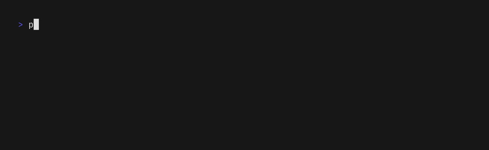
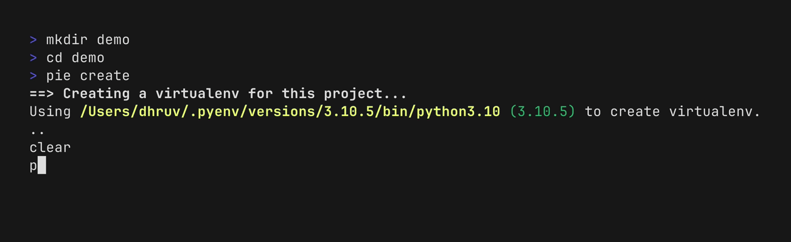
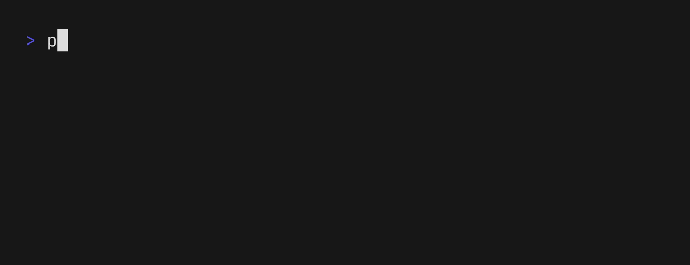

<div align="center">

# pie

_A command-line tool to manage Python virtual environments_

</div>

> **Warning**
>
> This tool is currently in **alpha**. There maybe breaking changes, although
> I'll try to avoid it as much as possible and if I can't, I'll provide
> clear instructions to migrate in the release notes. These changes will only
> be limited to a minor release.
>
> I also plan to change the tool name to avoid any misunderstanding and conflict.

## Overview

`pie` is a command-line tool to create and manage multiple Python virtual
environments. Some of the features are listed below:

- Single tool to manage all the environments
- Specify a Python version to create an environment
- Uses the [`venv`](https://docs.python.org/3/library/venv.html) module included
  in the standard library to create an environment
- Keep track of the project which uses the virtualenv
- Windows support

## Installation

### Using [Homebrew](https://brew.sh/)/[Linuxbrew](https://docs.brew.sh/Homebrew-on-Linux) on macOS/Linux:

```sh
brew tap dhruvmanila/pie https://github.com/dhruvmanila/pie
brew install pie
```

### Using [scoop](https://scoop.sh/) on Windows:

```sh
scoop install https://raw.githubusercontent.com/dhruvmanila/pie/main/scoop/pie.json
```

### Build from source

Recent [Go](https://go.dev/) toolchain is necessary to build from source. Use Go
1.16 or later.

```sh
# Install the latest stable version
go install github.com/dhruvmanila/pie@latest

# Install the head of main branch
go install github.com/dhruvmanila/pie
```

You can also download a binary from the
[releases](https://github.com/dhruvmanila/pie/releases/latest) page.

## Usage

To create an environment using the default Python version:

```bash
pie create
```
<p>

</p>
<br>

To create an environment using a specific Python version:

```bash
pie create --python 3.11.0
```

<p>

</p>
<br>

List out all the managed environments:

```bash
pie list  # or pie ls
```
Use the `--verbose` flag to show
information such as the Python version and project path.

<p>

</p>
<br>

Delete a virtualenv for the current project:

```bash
pie remove  # or pie rm
```

The `remove` command will only work from within the project directory for which
the virtual envionment was created for. The confirmation prompt can be skipped
with the `--yes` flag.

<p>

</p>
<br>

### Activating a virtual environment

The tool itself cannot activate a virtual environment as execution of the binary
takes place in a subshell and the virtual environment should be activated in the
current shell.

A workaround is to define a shell function to activate the virtualenv. To
support this with minimal shell scripting, a flag is provided which will print
out the absolute path to the virtual environment directory based on the current
working directory. In case there's no environment associated with the current
working directory, it will exit with code 1 without printing anything.

```bash
pie --venv
```

<p>

</p>
<br>

The tool keeps track of the project for which a specific virtual environment was
created for. This helps in finding out the venv directory based on the current
directory even if it's inside the root project directory.

Based on your preferred shell, you can use either of the following:

#### PowerShell

```powershell
# Activate a Python virtual environment built using the `pie` command.
# https://github.com/dhruvmanila/pie
function Pie-Activate() {
  if (Get-Command -Name pie -ErrorAction SilentlyContinue) {
    $VenvDir = (pie --venv)
    if ($VenvDir) {
      Invoke-Expression -Command "$VenvDir/Scripts/Activate.ps1"
    }
  }
}

# Alias it for quick activation
Set-Alias a Pie-Activate
```

#### bash/zsh

```sh
pie_activate() {
  # Activate a Python virtual environment built using the `pie` command.
  # https://github.com/dhruvmanila/pie
  #
  # The activation part cannot be a script as that is executed in a subshell
  # and so the `source` part will also be executed in the subshell instead of
  # the current shell.
  if command -v pie > /dev/null 2>&1; then
    VENV_DIR=$(pie --venv 2> /dev/null)
    if [ -n "$VENV_DIR" ]; then
      . "$VENV_DIR/bin/activate"
    fi
  fi
}

# Alias it for quick activation
alias a="pie_activate"
```

#### fish

## Development

### Building the project

The executable can be built using either the `make` command or using the `go
build` command directly. Refer to `make help` for more info.

To build a local snapshot using [`goreleaser`](https://goreleaser.com/) use the
following command:

```sh
goreleaser build --single-target --rm-dist --snapshot
```

This will create the release binary for your system in a `dist/` folder.

### Release process

The release is automated using [`goreleaser`](https://goreleaser.com/) and
GitHub Actions using this
[workflow](https://github.com/dhruvmanila/pie/blob/main/.github/workflows/release.yml).
It can be triggered by pushing the next version tag on GitHub. This will also
update the Homebrew and scoop package specification.

This project follows [Semantic Versioning](https://semver.org/).

## License

This project is licensed under the MIT License.

See [LICENSE](./LICENSE) for details.
